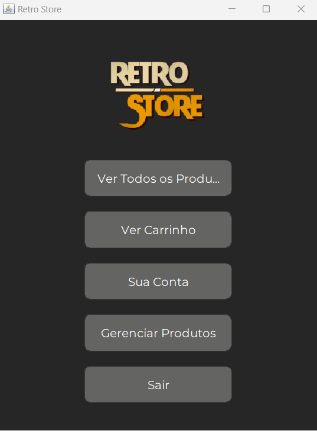

# RetroStore

RetroStore é um aplicativo Java para gerenciar uma loja de produtos, permitindo a visualização, compra e gestão de produtos via uma interface gráfica ou terminal.

## Índice

- [Visão Geral](#visão-geral)
- [Funcionalidades](#funcionalidades)
- [Interface Gráfica (MainGUI)](#interface-gráfica-maingui)
- [Versão de Terminal](#versão-de-terminal)
- [Instalação](#instalação)
- [Dependências](#dependências)
- [Uso](#uso)
  - [Interface Gráfica](#interface-gráfica)
  - [Terminal](#terminal)
- [Configuração](#configuração)
- [Desenvolvimento](#desenvolvimento)
- [Contribuição](#contribuição)
- [Licença](#licença)

## Visão Geral

RetroStore é um sistema de gerenciamento de loja que permite ao usuário:
- Visualizar e adicionar produtos ao carrinho.
- Gerenciar o estoque de produtos.
- Finalizar compras com diferentes métodos de pagamento.

## Funcionalidades

- **Interface Gráfica**:
  - Visualização e gestão de produtos.
  - Gerenciamento de conta e histórico de vendas.
  - Finalização de compras.
  
- **Versão de Terminal**:
  - Exibe produtos e permite adicionar ao carrinho.
  - Gerenciamento de estoque através de comandos de terminal.
  - Finalização de compras no terminal.

## Interface Gráfica (MainGUI)

A interface gráfica permite uma interação visual com a loja, usando componentes do Swing para melhorar a experiência.

### **Exemplo da Interface Gráfica**



## Versão de Terminal

A versão de terminal proporciona uma experiência simplificada para usuários que preferem usar o terminal para interagir com a loja.

### Screenshot do Terminal


## Instalação

### Pré-requisitos

- Java 11 ou superior
- IntelliJ (para excução rápida)

### Passos de Instalação

1. Clone o repositório:
    ```bash
    git clone https://github.com/joseminelli/Java.git
    cd retrostore
    ```

3. Execute a aplicação

## Dependências

RetroStore depende das seguintes bibliotecas:

- [Gson 2.8.6](https://mvnrepository.com/artifact/com.google.code.gson/gson/2.8.6): Para manipulação de JSON.


## Uso

### Interface Gráfica

1. **Executar a aplicação gráfica (MainGUI)**

2. **Navegar pela interface**:
    - **Ver Produtos**: Clique em "Ver Todos os Produtos" para listar os produtos disponíveis.
    - **Gerenciar Produtos**: Use "Gerenciar Produtos" para adicionar ou remover produtos.
    - **Carrinho**: Clique em "Ver Carrinho" para visualizar os itens no carrinho.
    - **Finalizar Compra**: Complete a compra através do menu de finalização.

3. **Adicionar Cliente**: Ao iniciar, se não houver clientes, será solicitado adicionar um novo cliente.

### Terminal

1. **Executar a versão de terminal**

2. **Navegar pelo menu**:
    - **Listar Produtos**: Mostra todos os produtos disponíveis.
    - **Adicionar ao Carrinho**: Insira o ID do produto para adicionar ao carrinho.
    - **Finalizar Compra**: Finalize a compra e exiba o resumo.
    - **Gerenciar Conta**:
        - **Ver Dados da Conta**: Mostra os detalhes da conta do cliente.
        - **Editar Dados da Conta**: Permite atualizar as informações do cliente.
        - **Ver Compras**: Exibe o histórico de compras.
        - **Voltar**: Retorna ao menu principal.

## Configuração

- **Arquivos de Configuração**: Certifique-se de que `clientes.json`,  `produtos.json`, `vendas.json` e `carrinho.json` estejam no diretório `src`.
- **Fonte Personalizada**: Certifique-se de ter o arquivo de fonte `Montserrat.ttf` no diretório apropriado para a interface gráfica.

## Contribuição

Sinta-se à vontade para enviar pull requests para melhorias ou correções de bugs.
